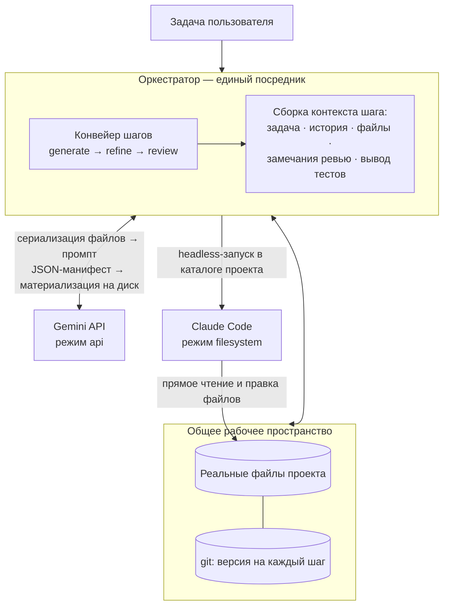

# Архитектура AI-оркестратора

Полное описание внутреннего устройства, протокола обмена, компонентов и расширяемости оркестратора.

## Общая идея

Оркестратор координирует работу нескольких AI-моделей (Gemini и Claude Code) в едином процессе разработки. Ключевая идея: модели обмениваются не сообщениями, а **реальными файлами и структурой проекта** в общем рабочем пространстве, а оркестратор выступает единственным посредником — управляет передачей файлов, версиями изменений и последовательностью шагов.

## Архитектурная диаграмма



## Компоненты системы

| Модуль | Назначение |
|---|---|
| **orchestrator/workspace.py** | Общее рабочее пространство: файлы проекта + git-версионирование, безопасное применение манифестов, экспорт содержимого в контекст моделей |
| **orchestrator/protocol.py** | Единый протокол обмена: `AgentResult`, `FileChange`, JSON-манифест, устойчивый парсер ответов моделей, защита путей |
| **orchestrator/agents/base.py** | Интерфейс `BaseAgent` (режимы `api` / `filesystem`) и единый сборщик контекстного промпта |
| **orchestrator/agents/gemini.py** | Адаптер Gemini: REST `generateContent`, принудительный JSON-ответ, ретраи |
| **orchestrator/agents/claude_code.py** | Адаптер Claude Code: headless-запуск CLI (`claude -p … --output-format json`) прямо в workspace |
| **orchestrator/orchestrator.py** | Ядро: цикл итераций, фиксация версий, запуск тестов, журналирование, критерий завершения |
| **orchestrator/pipelines.py** | Стандартный конвейер и загрузка пользовательского из JSON |
| **orchestrator/agents/mock.py** | Мок-агенты для офлайн-проверки всего контура без ключей и CLI |

## Структура проекта

```
ai-orchestrator/
├── orchestrator/                          # Основной пакет оркестратора
│   ├── __init__.py                        # Инициализация пакета
│   ├── cli.py                             # CLI-точка входа (argparse, запуск конвейера)
│   ├── orchestrator.py                    # Ядро: цикл итераций, управление git, запуск тестов
│   ├── workspace.py                       # Управление рабочим пространством, git-операции
│   ├── protocol.py                        # Протокол обмена (AgentResult, FileChange, парсер манифестов)
│   ├── pipelines.py                       # Загрузка и выполнение конвейеров из JSON
│   └── agents/                            # Адаптеры для различных AI-моделей
│       ├── __init__.py
│       ├── base.py                        # Базовый интерфейс BaseAgent и сборщик промптов
│       ├── gemini.py                      # Адаптер Gemini API (REST, JSON-ответы)
│       ├── claude_code.py                 # Адаптер Claude Code (headless CLI запуск)
│       └── mock.py                        # Мок-агенты для офлайн-тестирования
│
├── scripts/                               # Вспомогательные скрипты
│   ├── __init__.py
│   └── check_gemini_key.py                # Проверка рабочего состояния Gemini API ключа
│
├── examples/                              # Примеры использования
│   └── pipeline.example.json              # Пример пользовательского конвейера
│
├── workspaces/                            # Демонстрационные проекты (исключены из git)
│   ├── todo/                              # Demo: FastAPI TODO приложение
│   │   ├── .git/                          # Независимый git репозиторий
│   │   ├── app/                           # Исходный код приложения
│   │   ├── tests/                         # Тесты
│   │   ├── .orchestrator/                 # Артефакты оркестратора (журналы, ответы)
│   │   ├── README.md                      # Описание демо-проекта
│   │   ├── requirements.txt                # Зависимости Python
│   │   └── ...
│   │
│   ├── mock/                              # Demo: Мок-проект для офлайн-проверки
│   │   ├── .git/                          # Независимый git репозиторий
│   │   ├── calculator.py                  # Простой модуль-пример
│   │   ├── test_calculator.py             # Тесты к модулю
│   │   ├── .orchestrator/                 # Артефакты оркестратора
│   │   ├── README.md                      # Описание демо-проекта
│   │   └── ...
│   │
│   └── ...                                # Дополнительные demo-проекты по мере необходимости
│
├── .gitignore                             # Git исключения (workspaces/, __pycache__, .env и т.д.)
├── ARCHITECTURE.md                        # Этот файл (подробная архитектура)
├── EXAMPLES.md                            # Примеры команд запуска оркестратора
├── README.md                              # Основная документация (быстрый старт)
└── requirements.txt                       # Зависимости проекта (для разработки)
```

### Описание ключевых файлов

| Файл/Папка | Назначение |
|---|---|
| **orchestrator/cli.py** | CLI-интерфейс: парсинг аргументов, создание workspace, запуск конвейера |
| **orchestrator/orchestrator.py** | Главный цикл: чередование агентов → проверка тестов → фиксация версий в git |
| **orchestrator/workspace.py** | Управление файлами проекта, git-операции, безопасное применение манифестов |
| **orchestrator/protocol.py** | Структуры данных (AgentResult, FileChange), валидация путей, парсер JSON-манифестов |
| **orchestrator/pipelines.py** | Загрузка JSON-конвейера, интерпретация ролей агентов, логика завершения |
| **orchestrator/agents/base.py** | Базовый класс Agent, сборка контекстного промпта, общая логика для всех адаптеров |
| **orchestrator/agents/gemini.py** | Интеграция с Google Gemini API, отправка промптов, принудительный JSON-ответ |
| **orchestrator/agents/claude_code.py** | Headless запуск Claude Code CLI, захват изменений файлов через git |
| **orchestrator/agents/mock.py** | Мок-реализации для офлайн-тестирования без API ключей и CLI |
| **scripts/check_gemini_key.py** | Утилита для проверки валидности Gemini API ключа |
| **workspaces/** | Папка с независимыми git-репозиториями для demo-проектов; полностью исключена из основного репо |
| **.orchestrator/** | Служебная папка внутри workspace: логи, отчёты, сырые ответы моделей; исключена из git |

## Протокол обмена файлами

Принципиально различаются два режима интеграции, но снаружи оба сводятся к единому формату `AgentResult` со списком `FileChange`:

### Gemini (режим `api`)

Модель не видит файловую систему, поэтому оркестратор сериализует реальные файлы workspace в промпт (структура проекта + полное содержимое, с лимитами на объём), а от модели требует строгий JSON-манифест:

```json
{
  "summary": "что сделано",
  "status": "ok | approved | changes_requested",
  "notes": "замечания / план",
  "files": [
    {"path": "src/app.py", "action": "create|update|delete", "content": "полное содержимое"}
  ]
}
```

Манифест проверяется (запрещены абсолютные пути, `..`, запись в `.git` и `.orchestrator`) и **материализуется в реальные файлы** на диске. Формат ответа дополнительно фиксируется через `responseMimeType: application/json`.

### Claude Code (режим `filesystem`)

Агент с нативным доступом к файлам запускается в headless-режиме прямо в каталоге workspace и редактирует проект напрямую — это и есть «обмен через реальные файлы». После завершения оркестратор снимает фактические изменения через `git status` и включает их в общую историю.

## Версионирование и аудит

Каждый шаг любого агента фиксируется git-коммитом вида `[iter 2/refine/claude_code] <summary>`. Это даёт:

* полную историю «кто что изменил» (`git log`, `git diff <commit_a> <commit_b>`);
* откат к любому ходу (`git checkout <sha> -- .`);
* передачу следующему агенту гарантированно актуального состояния.

Дополнительно в `<workspace>/.orchestrator/` пишутся: пошаговый журнал `run-*.jsonl`, итоговый `report.json` и сырые ответы моделей в `raw/` (для отладки промптов). Каталог исключён из git.

### Артефакты оркестратора (.orchestrator/)

При каждом запуске в `<workspace>/.orchestrator/` создаются:

```
<workspace>/.orchestrator/
├── run-YYYYMMDD-HHMMSS.jsonl              # Пошаговый журнал в JSONL формате
├── report.json                            # Итоговый отчёт (статус, итерации, ошибки)
└── raw/                                   # Сырые ответы моделей для отладки
    ├── iter1-step1-gemini.txt
    ├── iter1-step2-claude_code.txt
    └── ...
```

## Цикл выполнения

Стандартный конвейер повторяет целевой сценарий:

```
итерация 1:  Gemini (generate) → Claude Code (refine) → [тесты] → Gemini (review)
итерации 2+:                     Claude Code (refine) → [тесты] → Gemini (review)
```

Замечания ревью (`notes` при `changes_requested`) и вывод тестов автоматически попадают в контекст следующего шага доработки. Ревьюер может и сам вносить мелкие правки через `files` — они тоже материализуются (пункт «обновлённые файлы снова отправляются в Gemini для доработки или проверки»).

**Завершение:** ревьюер вернул `approved` **и** тесты прошли (если задан `--test-command`) — либо исчерпан лимит `--max-iterations`. `approved` при падающих тестах не принимается: цикл продолжается, а ревью-замечание дополняется требованием починить тесты. Ошибка любого шага останавливает прогон с сохранением журнала и всех версий.

## Расширяемость: добавление новой модели

Реализуйте `BaseAgent` и зарегистрируйте его в реестре:

```python
from orchestrator.agents.base import BaseAgent, StepContext, build_prompt
from orchestrator.protocol import AgentResult, parse_manifest

class MyModelAgent(BaseAgent):
    name = "my_model"
    mode = "api"  # или "filesystem", если агент сам работает с диском

    def run(self, ctx: StepContext, workspace) -> AgentResult:
        prompt = build_prompt(ctx, include_files=True)
        text = call_my_model(prompt)          # ваш вызов API
        return parse_manifest(self.name, text)
```

Для `api`-агента достаточно вернуть манифест — применение к диску, коммит и журналирование сделает оркестратор. Для `filesystem`-агента изменения снимаются с диска автоматически.

## Безопасность

* Workspace стоит считать песочницей: Claude Code и команда тестов исполняют код в этом каталоге. Для недоверенных задач запускайте оркестратор в контейнере/VM.
* Пути из манифестов жёстко валидируются (без `..`, абсолютных путей и записи в служебные каталоги), но содержимое файлов модели определяют сами — ревью-шаг и тесты являются основной линией контроля качества.
* Флаги Claude Code CLI могут меняться между версиями — адаптер делает их настраиваемыми; актуальный список: `claude --help` и https://docs.claude.com/en/docs/claude-code/overview.
* Лимиты контекста: большие файлы усекаются при экспорте в промпт (настраивается в `Workspace.export_files`); при необходимости ограничивайте контекст шага полем `files`.
