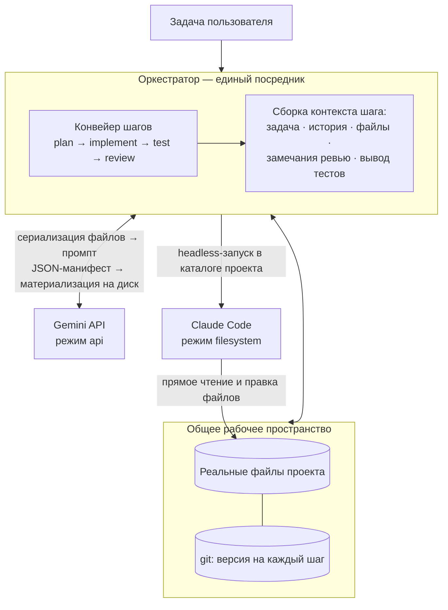

# Архитектура AI-оркестратора

Полное описание внутреннего устройства, протокола обмена, компонентов и расширяемости оркестратора.

## Общая идея

Оркестратор координирует работу нескольких AI-моделей (Gemini и Claude Code) в едином процессе разработки. Ключевая идея: модели обмениваются не сообщениями, а **реальными файлами и структурой проекта** в общем рабочем пространстве, а оркестратор выступает единственным посредником — управляет передачей файлов, версиями изменений и последовательностью шагов.

## Архитектурная диаграмма



## Структура проекта

```
ai-orchestrator/
├── orchestrator/                          # Основной пакет оркестратора
│   ├── __init__.py                        # Инициализация пакета
│   ├── cli.py                             # CLI-точка входа: argparse, загрузка .env, создание workspace, запуск конвейера
│   ├── orchestrator.py                    # Ядро: чередование агентов → запуск тестов → фиксация версий в git, журналы, критерий завершения
│   ├── workspace.py                       # Файлы проекта, git-операции, безопасное применение манифестов, экспорт контекста
│   ├── protocol.py                        # AgentResult, FileChange, валидация путей, парсер JSON-манифестов
│   ├── pipelines.py                       # Стандартный конвейер (plan→implement→test→review) и загрузка JSON
│   └── agents/                            # Адаптеры для различных AI-моделей
│       ├── __init__.py
│       ├── base.py                        # Базовый интерфейс BaseAgent и сборщик контекстного промпта
│       ├── gemini.py                      # Адаптер Gemini API (REST generateContent, принудительный JSON, ретраи)
│       ├── claude_code.py                 # Адаптер Claude Code (headless CLI, захват изменений через git)
│       └── mock.py                        # Мок-агенты для офлайн-тестирования без ключей и CLI
│
├── scripts/                               # Вспомогательные скрипты
│   └── check_gemini_key.py                # Проверка валидности Gemini API ключа
│
├── examples/                              # Примеры использования
│   └── pipeline.example.json              # Пример пользовательского конвейера
│
├── workspaces/                            # Демонстрационные проекты (исключены из git)
│   ├── todo/                              # Demo: FastAPI TODO приложение
│   │   ├── .git/                          # Независимый git репозиторий
│   │   ├── app/                           # Исходный код приложения
│   │   ├── tests/                         # Тесты
│   │   ├── .orchestrator/                 # Артефакты оркестратора (журналы, ответы)
│   │   ├── README.md                      # Описание демо-проекта
│   │   ├── requirements.txt                # Зависимости Python
│   │   └── ...
│   │
│   ├── mock/                              # Demo: Мок-проект для офлайн-проверки
│   │   ├── .git/                          # Независимый git репозиторий
│   │   ├── calculator.py                  # Простой модуль-пример
│   │   ├── test_calculator.py             # Тесты к модулю
│   │   ├── .orchestrator/                 # Артефакты оркестратора
│   │   ├── README.md                      # Описание демо-проекта
│   │   └── ...
│   │
│   └── ...                                # Дополнительные demo-проекты по мере необходимости
│
├── .gitignore                             # Git исключения (workspaces/, __pycache__, .env и т.д.)
├── .env.example                           # Шаблон .env: GEMINI_API_KEY (или GOOGLE_API_KEY)
├── AGENTS.md                              # Навигация по репозиторию для AI-агента: карта кода, команды, инварианты
├── ARCHITECTURE.md                        # Этот файл (подробная архитектура)
├── EXAMPLES.md                            # Примеры команд запуска оркестратора
├── README.md                              # Основная документация (быстрый старт)
└── pyproject.toml                         # Метаданные пакета, Python ≥ 3.10, dependencies = [], entry point ai-orchestrator
```

## Протокол обмена файлами

Принципиально различаются два режима интеграции, но снаружи оба сводятся к единому формату `AgentResult` со списком `FileChange`:

### Gemini (режим `api`)

Модель не видит файловую систему, поэтому оркестратор сериализует реальные файлы workspace в промпт (структура проекта + полное содержимое, с лимитами на объём), а от модели требует строгий JSON-манифест:

```json
{
  "summary": "что сделано",
  "status": "ok | approved | changes_requested",
  "notes": "замечания / план",
  "files": [
    {"path": "src/app.py", "action": "create|update|delete", "content": "полное содержимое"}
  ]
}
```

Манифест проверяется (запрещены абсолютные пути, `..`, запись в `.git` и `.orchestrator`) и **материализуется в реальные файлы** на диске. Формат ответа дополнительно фиксируется через `responseMimeType: application/json`.

### Claude Code (режим `filesystem`)

Агент с нативным доступом к файлам запускается в headless-режиме прямо в каталоге workspace и редактирует проект напрямую — это и есть «обмен через реальные файлы». После завершения оркестратор снимает фактические изменения через `git status` и включает их в общую историю.

## Версионирование и аудит

При первом обращении к workspace оркестратор инициализирует его: `git init` (если репозитория ещё нет), задаёт локальную идентичность коммитов (`AI Orchestrator <orchestrator@local>`), создаёт `.gitignore` (если его нет; в него попадают `.orchestrator/`, `__pycache__/`, `*.pyc`, `.venv/`, `node_modules/`) и делает стартовый пустой коммит `[orchestrator] init workspace`.

Каждый последующий шаг любого агента фиксируется git-коммитом вида `[iter 2/implement/claude_code] <summary>` (текст `summary` обрезается до 72 символов). Это даёт:

* полную историю «кто что изменил» (`git log`, `git diff <commit_a> <commit_b>`);
* откат к любому ходу (`git checkout <sha> -- .`);
* передачу следующему агенту гарантированно актуального состояния.

Дополнительно в `<workspace>/.orchestrator/` пишутся: пошаговый журнал `run-*.jsonl`, итоговый `report.json`, полный лог обмена с моделями в `raw/` (на каждый шаг — пара «запрос + ответ») и текущий промпт Claude Code `current_prompt.txt`. Каталог исключён из git (через автосозданный `.gitignore`).

### Артефакты оркестратора (.orchestrator/)

При каждом запуске в `<workspace>/.orchestrator/` создаются:

```
<workspace>/.orchestrator/
├── run-YYYYMMDD-HHMMSS.jsonl              # Пошаговый журнал в JSONL формате
├── report.json                            # Итоговый отчёт (статус, итерации, ошибки)
├── current_prompt.txt                     # Последний промпт, переданный Claude Code (перезаписывается)
└── raw/                                   # Полный лог обмена с моделями (для отладки промптов)
    ├── iter1-step1-gemini.request.txt     # Запрос, отправленный модели на шаге
    ├── iter1-step1-gemini.response.txt    # Сырой ответ модели на этот запрос
    ├── iter1-step2-claude_code.request.txt
    ├── iter1-step2-claude_code.response.txt
    └── ...
```

Запрос (`.request.txt`) — это полный собранный промпт шага (задача, инструкция, история, контекст файлов; для Gemini дополнительно системная инструкция и схема манифеста). Ответ (`.response.txt`) — сырой вывод модели до парсинга. Файл пишется, только если соответствующая строка непустая (у мок-агентов ответы — плейсхолдеры).

## Модульный конвейер

Конвейер — это список шагов (`Step`), а не зашитый сценарий. Каждый шаг — одного из двух видов (`kind`):

| `kind` | Что делает | Ключевые поля |
|---|---|---|
| **`agent`** | работу выполняет исполнитель по инструкции | `executor`, `role`, `instruction`, `gate`, `only_first_iteration`, `include_file_contents`, `files` |
| **`test`** | оркестратор сам запускает `--test-command`, без модели; результат идёт в контекст следующих шагов | — |

**Исполнитель указывается абстрактно** полем `executor`: `"api"` (модель через REST, по умолчанию Gemini) или `"claude"` (Claude Code, нативный доступ к ФС). Конкретного агента под тип подставляет CLI ([реестр в cli.py](orchestrator/cli.py)), поэтому один и тот же конвейер работает и на боевых, и на мок-агентах. Чтобы поменять исполнителя этапа — достаточно сменить `executor` в JSON.

`role` — только ярлык/селектор инструкции (`plan`, `implement`, `review`, любой свой), на поведение он не влияет. Завершением прогона управляет флаг **`gate`**: шаг с `gate=true`, вернувший `status=approved`, закрывает прогон.

### Стандартный конвейер

```
итерация 1:  plan (api) → implement (claude) → [test] → review (api, gate)
итерации 2+:              implement (claude) → [test] → review (api, gate)
```

Шаг `plan` (`only_first_iteration=true`) один раз пишет план в `PLAN.md`; дальше крутится цикл `implement → test → review`. Этап `implement` при желании дробится на несколько шагов (бэкенд, фронтенд, тесты) — план их и предусматривает; см. [examples/pipeline.example.json](examples/pipeline.example.json).

Замечания ревью (`notes` при `changes_requested`) и вывод шага `test` автоматически попадают в контекст следующей доработки. Ревьюер может и сам вносить мелкие правки через `files` — они тоже материализуются.

**Завершение:** gate-шаг вернул `approved` **и** последние тесты прошли (если в конвейере есть шаг `test` и задан `--test-command`) — либо исчерпан лимит `--max-iterations`. `approved` при падающих тестах не принимается: цикл продолжается, а ревью-замечание дополняется требованием починить тесты. Ошибка шага-агента останавливает прогон с сохранением журнала и всех версий; падение тестов ошибкой не считается (это вход для доработки).

## Расширяемость

### Своя модель

Реализуйте `BaseAgent` и зарегистрируйте под нужным типом исполнителя (`"api"` / `"claude"`) в [cli.py](orchestrator/cli.py):

```python
from orchestrator.agents.base import BaseAgent, StepContext, build_prompt
from orchestrator.protocol import AgentResult, parse_manifest

class MyModelAgent(BaseAgent):
    name = "my_model"
    mode = "api"  # или "filesystem", если агент сам работает с диском

    def run(self, ctx: StepContext, workspace) -> AgentResult:
        prompt = build_prompt(ctx, include_files=True)
        text = call_my_model(prompt)          # ваш вызов API
        return parse_manifest(self.name, text)

# в cli.py:  agents = {"api": MyModelAgent(), "claude": ClaudeCodeAgent(...)}
```

Для `api`-агента достаточно вернуть манифест — применение к диску, коммит и журналирование сделает оркестратор. Для `filesystem`-агента изменения снимаются с диска автоматически. `mode` (`api`/`filesystem`) определяет способ передачи файлов и должен соответствовать типу исполнителя.

### Свой этап

Добавьте шаг в JSON-конвейер: для работы модели — `{"kind":"agent","executor":"…","role":"…","instruction":"…"}`, для прогона тестов — `{"kind":"test"}`. Гейтом завершения пометьте нужный шаг `"gate": true`.

## Безопасность

* Workspace стоит считать песочницей: Claude Code и команда тестов исполняют код в этом каталоге. Для недоверенных задач запускайте оркестратор в контейнере/VM.
* Пути из манифестов жёстко валидируются (без `..`, абсолютных путей и записи в служебные каталоги), но содержимое файлов модели определяют сами — ревью-шаг и тесты являются основной линией контроля качества.
* Флаги Claude Code CLI могут меняться между версиями — адаптер делает их настраиваемыми; актуальный список: `claude --help` и https://docs.claude.com/en/docs/claude-code/overview.
* Лимиты контекста: большие файлы усекаются при экспорте в промпт (настраивается в `Workspace.export_files`); при необходимости ограничивайте контекст шага полем `files`.
