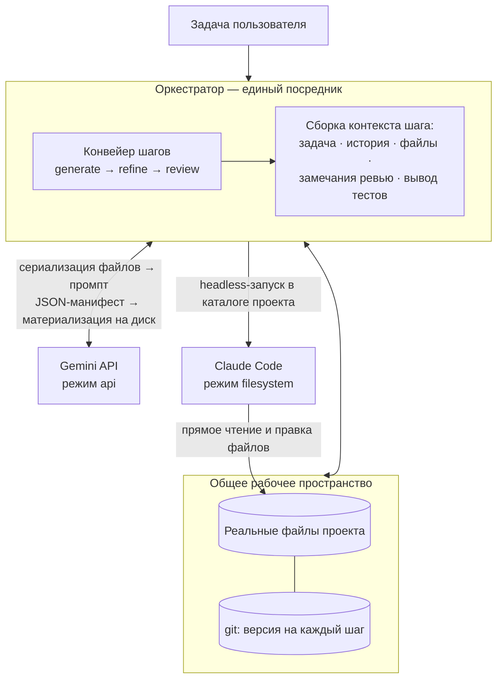

# AI-оркестратор: совместная разработка несколькими LLM

Оркестратор координирует работу нескольких AI-моделей (Gemini и Claude Code) в едином процессе разработки. Ключевая идея: модели обмениваются не сообщениями, а **реальными файлами и структурой проекта** в общем рабочем пространстве, а оркестратор выступает единственным посредником — управляет передачей файлов, версиями изменений и последовательностью шагов.

Зависимостей нет — только стандартная библиотека Python ≥ 3.10 и установленный `git`.

## Архитектура



Компоненты:

| Модуль | Назначение |
|---|---|
| `orchestrator/workspace.py` | Общее рабочее пространство: файлы проекта + git-версионирование, безопасное применение манифестов, экспорт содержимого в контекст моделей |
| `orchestrator/protocol.py` | Единый протокол обмена: `AgentResult`, `FileChange`, JSON-манифест, устойчивый парсер ответов моделей, защита путей |
| `orchestrator/agents/base.py` | Интерфейс `BaseAgent` (режимы `api` / `filesystem`) и единый сборщик контекстного промпта |
| `orchestrator/agents/gemini.py` | Адаптер Gemini: REST `generateContent`, принудительный JSON-ответ, ретраи |
| `orchestrator/agents/claude_code.py` | Адаптер Claude Code: headless-запуск CLI (`claude -p … --output-format json`) прямо в workspace |
| `orchestrator/orchestrator.py` | Ядро: цикл итераций, фиксация версий, запуск тестов, журналирование, критерий завершения |
| `orchestrator/pipelines.py` | Стандартный конвейер и загрузка пользовательского из JSON |
| `orchestrator/agents/mock.py` | Мок-агенты для офлайн-проверки всего контура без ключей и CLI |

## Как происходит обмен файлами

Принципиально различаются два режима интеграции, но снаружи оба сводятся к единому формату `AgentResult` со списком `FileChange`:

**Gemini (режим `api`).** Модель не видит файловую систему, поэтому оркестратор сериализует реальные файлы workspace в промпт (структура проекта + полное содержимое, с лимитами на объём), а от модели требует строгий JSON-манифест:

```json
{
  "summary": "что сделано",
  "status": "ok | approved | changes_requested",
  "notes": "замечания / план",
  "files": [
    {"path": "src/app.py", "action": "create|update|delete", "content": "полное содержимое"}
  ]
}
```

Манифест проверяется (запрещены абсолютные пути, `..`, запись в `.git` и `.orchestrator`) и **материализуется в реальные файлы** на диске. Формат ответа дополнительно фиксируется через `responseMimeType: application/json`.

**Claude Code (режим `filesystem`).** Агент с нативным доступом к файлам запускается в headless-режиме прямо в каталоге workspace и редактирует проект напрямую — это и есть «обмен через реальные файлы». После завершения оркестратор снимает фактические изменения через `git status` и включает их в общую историю.

## Версионирование и аудит

Каждый шаг любого агента фиксируется git-коммитом вида `[iter 2/refine/claude_code] <summary>`. Это даёт:

* полную историю «кто что изменил» (`git log`, `git diff <commit_a> <commit_b>`);
* откат к любому ходу (`git checkout <sha> -- .`);
* передачу следующему агенту гарантированно актуального состояния.

Дополнительно в `<workspace>/.orchestrator/` пишутся: пошаговый журнал `run-*.jsonl`, итоговый `report.json` и сырые ответы моделей в `raw/` (для отладки промптов). Каталог исключён из git.

## Цикл выполнения

Стандартный конвейер повторяет целевой сценарий:

```
итерация 1:  Gemini (generate) → Claude Code (refine) → [тесты] → Gemini (review)
итерации 2+:                     Claude Code (refine) → [тесты] → Gemini (review)
```

Замечания ревью (`notes` при `changes_requested`) и вывод тестов автоматически попадают в контекст следующего шага доработки. Ревьюер может и сам вносить мелкие правки через `files` — они тоже материализуются (пункт «обновлённые файлы снова отправляются в Gemini для доработки или проверки»).

Завершение: ревьюер вернул `approved` **и** тесты прошли (если задан `--test-command`) — либо исчерпан лимит `--max-iterations`. `approved` при падающих тестах не принимается: цикл продолжается, а ревью-замечание дополняется требованием починить тесты. Ошибка любого шага останавливает прогон с сохранением журнала и всех версий.

## Установка и запуск

```bash
# 1. Окружение
export GEMINI_API_KEY="..."                      # ключ Google AI Studio
npm install -g @anthropic-ai/claude-code         # CLI Claude Code (+ аутентификация)

# 2. Запуск (из корня репозитория; либо pip install -e . → команда ai-orchestrator)
python -m orchestrator.cli \
    --workspace ./my-project \
    --objective "Сделай REST API списка задач на FastAPI с тестами" \
    --test-command "python -m pytest -q" \
    --max-iterations 4
```

Полезные опции: `--gemini-model`, `--claude-model`, `--claude-permission-mode` (по умолчанию `acceptEdits`; набор режимов смотрите в `claude --help` своей версии), `--claude-max-turns`, `--pipeline path.json`, `--objective-file`, `--verbose`.

## Этапы проверки перед запуском

### 1️⃣ Запуск мока (офлайн, без ключей)

Первым делом проверь, что весь контур работает:

```bash
python -m orchestrator.cli --workspace ./demo-mock --mock --verbose
```

**Что произойдёт:**
- ✓ Мок-генератор создаст файлы проекта
- ✓ Мок-доработчик улучшит код
- ✓ Запустятся тесты
- ✓ Мок-ревьюер проведёт проверку
- ✓ Возможны несколько итераций до `approved`

**Результат:** в `./demo-mock` будет полная git-история всех шагов. Если контур прошёл успешно — всё готово для реального запуска.

### 2️⃣ Проверка Gemini API ключа

```bash
python -m scripts.check_gemini_key
python -m scripts.check_gemini_key --model gemini-2.5-pro
```

**Если успешно:** видишь `[OK] Ключ рабочий. Ответ модели: 'Pong'`

**Если ошибка:**
- `[FAIL] Ключ не найден` → установи `GEMINI_API_KEY` в `.env` или окружение
- `API_KEY_INVALID` → ключ неправильный
- `HTTP 403` → доступа нет (включи Generative Language API в Google Cloud)
- `HTTP 429` → квота исчерпана (подожди 24 часа или обнови план)
- `HTTP 404` → модель недоступна для этого ключа

### 3️⃣ Проверка Claude Code CLI

```bash
claude --version
claude --help
```

**Если ошибка:** установи с `npm install -g @anthropic-ai/claude-code` и авторизуйся

### 4️⃣ Проверка рабочей среды

```bash
# Python 3.10+
python --version

# Git
git --version

# Команда тестирования (если будешь использовать)
python -m pytest --version
# или
python -m unittest discover --help
```

### 5️⃣ Полный запуск оркестратора

Только после всех проверок:

```bash
python -m orchestrator.cli \
    --workspace ./my-project \
    --objective "Сделай REST API списка задач на FastAPI с тестами" \
    --test-command "python -m pytest -q" \
    --max-iterations 4 \
    --verbose
```

### Офлайн-проверка контура (без ключей)

```bash
python -m orchestrator.cli --workspace ./demo --mock \
    --test-command "python3 -m unittest discover -q"
```

Мок-конвейер воспроизводит полный цикл: генерация файлов по манифесту → правка реальных файлов на диске → тесты → ревью с замечаниями → доработка по замечаниям → `approved` на второй итерации. В `./demo` останется настоящая git-история всех ходов.

## Свой конвейер

Последовательность шагов задаётся JSON-файлом (`--pipeline examples/pipeline.example.json`):

```json
[
  {"agent": "gemini", "role": "generate", "instruction": "...", "only_first_iteration": true},
  {"agent": "claude_code", "role": "refine", "instruction": "..."},
  {"agent": "gemini", "role": "review", "instruction": "..."}
]
```

Поля шага: `agent` (ключ в реестре агентов), `role` (`generate` / `refine` / `review` влияют на логику тестов и завершения), `instruction`, `only_first_iteration`, `include_file_contents`, `files` (ограничить контекст конкретными путями).

## Добавление новой модели

Реализуйте `BaseAgent` и зарегистрируйте его в реестре:

```python
from orchestrator.agents.base import BaseAgent, StepContext, build_prompt
from orchestrator.protocol import AgentResult, parse_manifest

class MyModelAgent(BaseAgent):
    name = "my_model"
    mode = "api"  # или "filesystem", если агент сам работает с диском

    def run(self, ctx: StepContext, workspace) -> AgentResult:
        prompt = build_prompt(ctx, include_files=True)
        text = call_my_model(prompt)          # ваш вызов API
        return parse_manifest(self.name, text)
```

Для `api`-агента достаточно вернуть манифест — применение к диску, коммит и журналирование сделает оркестратор. Для `filesystem`-агента изменения снимаются с диска автоматически.

## Ограничения и безопасность

* Workspace стоит считать песочницей: Claude Code и команда тестов исполняют код в этом каталоге. Для недоверенных задач запускайте оркестратор в контейнере/VM.
* Пути из манифестов жёстко валидируются (без `..`, абсолютных путей и записи в служебные каталоги), но содержимое файлов модели определяют сами — ревью-шаг и тесты являются основной линией контроля качества.
* Флаги Claude Code CLI могут меняться между версиями — адаптер делает их настраиваемыми; актуальный список: `claude --help` и https://docs.claude.com/en/docs/claude-code/overview.
* Лимиты контекста: большие файлы усекаются при экспорте в промпт (настраивается в `Workspace.export_files`); при необходимости ограничивайте контекст шага полем `files`.
